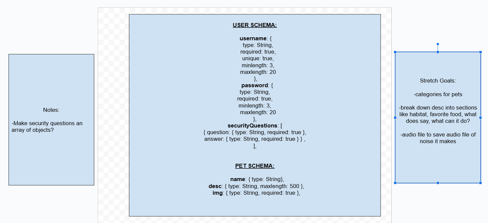

# Hafa Adai 🌻🐡

## Welcome to my Capstone project for my Per Scholas Software Development training program 🎊

### In order to showcase all of the skills I've aquired on this 16 week learning journey, I have developed a full stack web app game for kids called **_Fantastical Pets_**. It allows users to choose 2 creatures and morph them into one cute critter. They can decide if they want to give their new pet a name and / or description or have AI do it for them. They can also add it to their collection see a gallery of all the pets they've created.

#### Link to FrontEnd Repo: https://github.com/geiselleholt/fantasticalpets

#### Link to BackEnd Deployment:

### Objectives of the Capstone:

Create a practical MERN stack application that, solves problem, makes your life easier or does something cool

### Requirements:

- Full CRUD capabilities - at least these 4 routes ✅
- Schema ✅
- Index ✅
- Connected to your DB ✅
- 25 commits total +/- 3 ✅
- Well documented README
  - List of technologies used ✅
  - Acknowledgements for any resources ✅
  - Description of you Application ✅
  - Use MarkDown Language ✅
  - Link to other REPO ✅

### Tools I used:

- node.js
- nodemon
- express
- mongodb
- mongoose
- dotenv
- cors
- bcryptjs
- jsonwebtoken
- morgan

### Acknowledgements

- Gemini Flash 2.0 API for generating Pet names and descriptions (SO COOL 😎)

  - https://ai.google.dev/gemini-api/docs/text-generation

- DeepAI API for generating images (Also SO COOL 😎)

  - https://deepai.org/docs#ai-image-generator

- My classmate Durga Pushadapu who brilliantly suggested I save animal1 and animal2 with the imageURL to my DB so I can recall the hybrid pets already created and dramatically reduce the number API calls to DeepAI

- My instructor Dylan Comeau, @comeaudc, who walked us through developing a fullstack app from scratch including employing JWT and bcrypt as well as deployment. I refered to this repo A LOT

  - [TheGamesShop](https://github.com/comeaudc/TheGamesShopBE)

- My TA Constance Nwaigwe for giving me direction and answering all my questions

- StackOverFlow, Gemini, Microsoft Copilot (formerly Bing, not the Copilot that spoon feeds you code because that's plagiarism) for helping debug the 1 million errors I made and for verbage for content

### Wire Frame for Data Structure:

- I didn't stick with this but it was a good start

### Routes:

| METHOD | PATH                | DESCRIPTION                                      | AUTH    |
| ------ | ------------------- | ------------------------------------------------ | ------- |
| POST   | /api/image          | Find existing image or CREATE a new image        | Public  |
| GET    | /api/image/seed     | SEED image data into DB                          | Public  |
| POST   | /api/pet            | CREATE new Pet for a User                        | Private |
| GET    | /api/pet/user       | READ all pets for a User                         | Private |
| PUT    | /api/pet/:id        | UPDATE one Pet                                   | Private |
| DELETE | /api/pet/:id        | DELETE one Pet                                   | Private |
| POST   | /api/pet/aiDetails  | CREATE pet details using Gemini API              | Public  |
| POST   | /api/user/signUp    | CREATE a token and signUp a User                 | Public  |
| POST   | /api/user/signIn    | CREATE a token to authenticate and signIn a User | Public  |
| POST   | /api/user/questions | Find User and return their security questions    | Public  |
| POST   | /api/user/answers   | Verify security answers and signIn User          | Public  |
